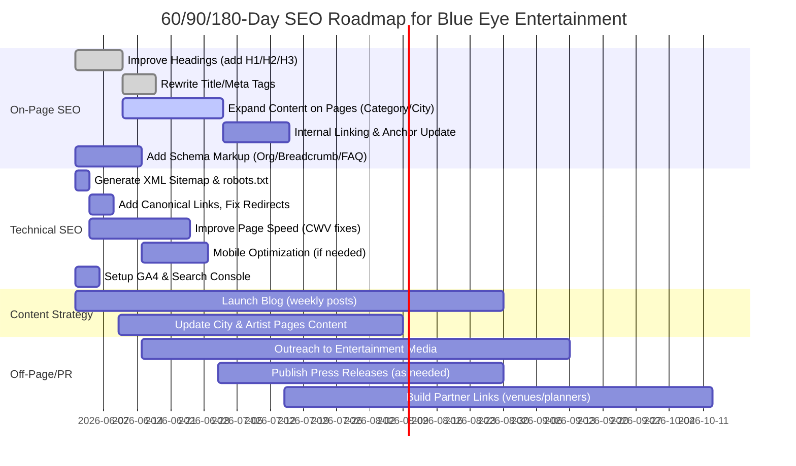

# Executive Summary  
Blue Eye Entertainment’s website currently lacks key SEO fundamentals (for example, the homepage has *no* H1 heading【5†L189-L191】) and is thin on content. To improve rankings and visibility, we recommend a clear, phased SEO roadmap covering **on-page optimization**, **technical fixes**, **content planning**, **link-building/PR**, and **measurement**. Key actions include adding descriptive H1–H3 headings and unique meta tags; expanding page content to ~800–1500 words; using structured internal linking with descriptive anchor text【22†L502-L510】; implementing relevant **Schema** markup (Organization, BreadcrumbList, FAQPage, Person, LocalBusiness); ensuring technical basics (sitemaps, canonical URLs, robots.txt); and launching a content calendar (blog topics, city/city spotlight pieces). We will track progress via GA4 and Search Console, focusing on organic traffic, key query rankings, and conversion events. The following sections detail priorities, examples, and a 60/90/180-day timeline (see Gantt chart below) to guide the agency.

## Current Site Audit & Competitor Context  
- **Headings:** The homepage has no H1; only H2s like “Book in 3 Easy Steps,” “What They Say About Us,” etc【8†L63-L71】【8†L94-L102】. Google advises using *one unique H1 per page* to clearly signal the main topic【5†L189-L191】. Likewise, category/city pages need distinct H1s.  
- **Title/Meta:** Titles and descriptions are templated (e.g. “Blue Eye Entertainment – Book Celebrity Artists in India”) and some are duplicated. We will write unique, keyword-focused titles and metas for each page (e.g. “Singer Artists – Hire Singers for Weddings & Corporate Events”). Google’s snippet guidelines say **“create unique descriptions for each page”** to accurately summarize its content【26†L467-L475】.  
- **Content:** Category pages (e.g. Singers) and city pages have minimal copy beyond short intros and lists of artists. We recommend adding **section content** (see tables below) to reach ~1000–1500 words on categories, ~800–1200 on city pages, and several hundred on profiles. This aligns with best practices for informative pages.  
- **Internal Linking:** The site has some menu links but no contextual links. We will introduce descriptive internal links (e.g. link from a singer profile back to the Singers category with anchor “singer artists”). Use clear, relevant anchor text rather than “click here”【22†L502-L510】 to improve crawlability and context.  
- **Images & Speed:** Many images lack alt text. We will add descriptive alt attributes and compress images (using WebP or lazy-loading) to improve load times. Core Web Vitals targets (LCP <2.5s, INP <200ms, CLS <0.1) should be met through optimization【12†L418-L426】.  
- **Schema:** No structured data is present. We will add JSON-LD for Organization (on homepage), Breadcrumbs (on multi-level pages), FAQ (on helpful Q&A pages), Person/Artist (on profile pages), and LocalBusiness (on contact/about page) to help Google understand and display rich results.  
- **Technical:** The site needs a proper XML sitemap (submitted via Search Console or robots.txt【17†L624-L633】), canonical link tags on each page【20†L578-L586】, and a robots.txt that does not block key pages. We will also ensure mobile-friendliness and fast hosting/CDN usage.  

## On-Page Optimization  

### Homepage Structure  
- **H1 Tag:** Add a clear H1 like “Book Celebrity Artists, Singers, DJs & Comedians in India” (all main keyword themes). Google recommends a unique, prominent H1 on every page【5†L189-L191】【31†L468-L475】.  
- **Subheadings (H2/H3):** Example H2s: “Book in 3 Easy Steps,” “Featured Categories,” “Top Cities,” “What Clients Say,” “Ready to Book?”. Under each, H3s can introduce bullet steps or testimonials. For instance: 
  - H2: *“Book in 3 Easy Steps”* (sub-steps with H3’s for each step)
  - H2: *“What Clients Say About Us”* (H3 for testimonial title, H4 for quote)
  - H2: *“Ready to Make Your Event Unforgettable?”*  
- **Content:** Include a concise introductory paragraph under the H1 explaining Blue Eye’s service (approx. 100–150 words). Each section (e.g. “How It Works,” “Testimonials”) should have brief supportive content. Ensure each H2/H3 is keyword-relevant.  
- **Meta Tags:**  
  - **Title:** e.g. *“Blue Eye Entertainment – Book Celebrity Artists in India”* (50–60 chars). We will “brand concisely” as Google suggests【31†L462-L470】, e.g. include brand name at the end.  
  - **Description:** e.g. *“Blue Eye Entertainment is India’s leading artist booking platform. Discover and hire top singers, DJs, comedians, and more for weddings, corporate events, and private parties.”* (150–160 chars). Must be unique and descriptive【26†L467-L475】【26†L505-L513】.  

### Category Page Template (e.g. Singers, DJs, Comedians)  
Each category page (like **Singers**) will follow a template:  
- **URL:** `/category/singer` (for example).  
- **H1 Example:** *“Singer Artists for Weddings, Corporate & Private Events”*. This targets key phrases (singer, weddings, events).  
- **Introduction:** 1–2 paragraphs (~150–250 words) summarizing the category (e.g., “Our verified singer artists span every genre from Bollywood playback to indie pop. Whether it’s a wedding reception or a corporate gala, find the perfect singer performer here.”).  
- **H2 Example:** *“Featured Singers”* or *“All City Singers”* (followed by city filters or top 5 artists list).  
- **Additional H2/H3:**  
  - *“Why Book Singers Through Blue Eye”* (H2) – short content (100–150 words) about vetting, guarantees, etc.  
  - *“Singer Booking FAQ”* (H2) – accordion or list of common questions (we’ll mark these up with FAQ schema).  
- **Footer Links:** At bottom, link to related categories (e.g. “Top DJs”, “Bollywood Celebrities”) with appropriate anchors.  

**Word Count & Sections:** Aim for **1,000–1,500 words** total (including artist listings, intro, FAQs). More depth than competitors will help rankings. Below is a summary table for page templates:

| Page Type       | Example H1                                      | Example H2/H3                   | Word Count | Key Content Sections                               |
|-----------------|-------------------------------------------------|---------------------------------|------------|----------------------------------------------------|
| **Homepage**    | *“Book Celebrity Artists, Singers, DJs & Comedians in India”* | *H2:* Book in 3 Easy Steps; What Clients Say; Featured Categories; Top Cities | 300–500   | Hero intro text; how-it-works; testimonials; category & city links |
| **Category**    | *“Singer Artists for Weddings & Events”*        | *H2:* Featured Singers; Why Choose Singers; FAQ | 1000–1500 | Category intro; top artists list; benefits; FAQ    |
| **City (e.g. Mumbai)** | *“Artists in Mumbai for Events”*          | *H2:* Top Mumbai Performers; Why Mumbai Events; FAQ | 800–1200  | City overview (culture/events); featured artists in city; booking info; FAQ |
| **Artist Profile** | *“Caralisa Monteiro” (with role “Singer”)*    | *H2:* About Caralisa Monteiro; Booking Options; Past Performances | 300–600  | Artist bio and achievements; sample repertoire or packages; booking/contact info |

### Sample Title Tags and Meta Descriptions  

| Page               | Title Tag (≤60 chars)                                    | Meta Description (≤160 chars)                              |
|--------------------|----------------------------------------------------------|-------------------------------------------------------------|
| Homepage           | *“Blue Eye Entertainment – Book Celebrity Artists in India”* | *“Blue Eye Entertainment is India’s leading artist booking platform. Discover and hire top singers, DJs, comedians, and more for your events.”* |
| Category – Singers | *“Singer Artists – Book Singers for Weddings & Events”* | *“Hire certified singer artists across India for weddings, corporate events, and private parties. Browse styles from pop to classical with Blue Eye.”* |
| City – Mumbai      | *“Mumbai Artists – Book Performers in Mumbai”*           | *“Find and book Mumbai’s top artists for concerts, weddings, and corporate events. Explore singers, dancers, DJs and more in Mumbai.”* |
| Artist Profile     | *“Book Caralisa Monteiro – Singer | Blue Eye”*              | *“Book Caralisa Monteiro, award-winning Indian singer known for Bollywood hits and fusion covers. Available for weddings and events.”* |

Each page’s meta should be unique and human-readable【26†L467-L475】. We will front-load primary keywords and keep them within display limits (50–60 chars) as Google recommends【31†L462-L470】.

### Internal Linking & Anchor Text Strategy  
We will create a clear, crawlable internal link structure. For example:  
- **Homepage → Category/City Pages:** Use descriptive anchors like “Singer Artists” or “Mumbai Artists” linking to those pages.  
- **Category Pages → Artist Profiles:** Each listed artist links via their name (e.g. “Caralisa Monteiro”) to the profile page. Also link between related categories (e.g. on the Singers page link to “Top DJs” or “Bollywood Celebrities” pages).  
- **Artist Profiles → Category/City:** Include links like “Other Singer Artists” (back to Singers) and “Artists in Mumbai” (if applicable).  
Good anchor text should **reflect the linked page’s topic**【22†L502-L510】. We will avoid vague text (e.g. “click here”) and use the actual category or artist names. This helps both users and Google understand page relationships【22†L502-L510】.

### Schema Markup (JSON-LD Examples)  
Implementing structured data can enable rich results. Example snippets (to be placed in `<head>`):  

- **Organization (Home Page):** Include company info, logo, social profiles.  
  ```html
  <script type="application/ld+json">
  {
    "@context": "https://schema.org",
    "@type": "Organization",
    "name": "Blue Eye Entertainment",
    "url": "https://blueeyeentertainment.in",
    "logo": "https://blueeyeentertainment.in/images/logo.png",
    "sameAs": [
      "https://www.facebook.com/theblueeyeentertainment",
      "https://www.instagram.com/theblueeyeentertainment",
      "https://twitter.com/BlueEyeEnt"
    ],
    "address": {
      "@type": "PostalAddress",
      "streetAddress": "123 Example Street",
      "addressLocality": "Mumbai",
      "addressRegion": "Maharashtra",
      "postalCode": "400001",
      "addressCountry": "IN"
    },
    "contactPoint": {
      "@type": "ContactPoint",
      "contactType": "Customer Service",
      "telephone": "+91-XXXXXXXXXX",
      "email": "info@blueeyeentertainment.in"
    }
  }
  </script>
  ```  
  Including Organization data helps Google understand the business’ identity (logo, contacts)【33†L412-L421】.  

- **BreadcrumbList (All Pages with Hierarchy):** On category, city, and profile pages, add breadcrumb trails. Example for a category page:  
  ```html
  <script type="application/ld+json">
  {
    "@context": "https://schema.org",
    "@type": "BreadcrumbList",
    "itemListElement": [
      { "@type": "ListItem", "position": 1, "name": "Home", "item": "https://blueeyeentertainment.in/" },
      { "@type": "ListItem", "position": 2, "name": "Singers", "item": "https://blueeyeentertainment.in/category/singer" }
    ]
  }
  </script>
  ```  
  Use the schema.org `BreadcrumbList` format【35†L639-L647】 to mark each step. Google looks for this to show clickable breadcrumbs in SERPs.

- **FAQPage (Category/Help Pages):** If you have a list of Q&A (e.g. “How do I book an artist?”), markup as FAQPage:  
  ```html
  <script type="application/ld+json">
  {
    "@context": "https://schema.org",
    "@type": "FAQPage",
    "mainEntity": [
      {
        "@type": "Question",
        "name": "How do I book an artist through Blue Eye?",
        "acceptedAnswer": {
          "@type": "Answer",
          "text": "Browse artist profiles or categories, request a quote, and our team will confirm availability within 1-2 days."
        }
      },
      {
        "@type": "Question",
        "name": "What is the booking process?",
        "acceptedAnswer": {
          "@type": "Answer",
          "text": "After you submit a request, we handle the contract and payment. You only pay 50% upfront and the rest on the event day."
        }
      }
      /* Add more FAQs as needed */
    ]
  }
  </script>
  ```  
  (Note: Google announced deprecation of FAQ rich results in mid-2026【37†L409-L417】, so this may not yield rich snippets, but it still organizes content.)

- **Person/ProfilePage (Artist Pages):** For each artist profile, mark up the individual as a `Person`:  
  ```html
  <script type="application/ld+json">
  {
    "@context": "https://schema.org",
    "@type": "Person",
    "name": "Caralisa Monteiro",
    "jobTitle": "Singer",
    "image": "https://blueeyeentertainment.in/images/artists/caris.jpg",
    "url": "https://blueeyeentertainment.in/artists/caris",
    "description": "Caralisa Monteiro is a renowned Indian singer known for Bollywood hits and fusion music.",
    "sameAs": [
      "https://www.facebook.com/caris.international",
      "https://www.instagram.com/caris",
      "https://twitter.com/CaralisaM"
    ]
  }
  </script>
  ```  
  (Alternatively, wrap the profile page with `ProfilePage` and nest the `Person` as its mainEntity【43†L23-L30】.) This highlights the artist’s identity to search engines.

- **LocalBusiness (Contact/About Page):** If Blue Eye has a physical office or is a registered agency, mark it as a `LocalBusiness` or subtype (e.g. “EventPlanner” or “EntertainmentBusiness”). For example:  
  ```html
  <script type="application/ld+json">
  {
    "@context": "https://schema.org",
    "@type": "EntertainmentBusiness",
    "name": "Blue Eye Entertainment",
    "image": "https://blueeyeentertainment.in/images/logo.png",
    "address": {
      "@type": "PostalAddress",
      "streetAddress": "123 Example Street",
      "addressLocality": "Mumbai",
      "addressRegion": "Maharashtra",
      "postalCode": "400001",
      "addressCountry": "IN"
    },
    "telephone": "+91-XXXXXXXXXX",
    "openingHours": "Mo-Fr 09:00-18:00",
    "sameAs": [
      "https://www.facebook.com/theblueeyeentertainment",
      "https://www.instagram.com/theblueeyeentertainment"
    ]
  }
  </script>
  ```  
  Google recommends using the most specific subtype of `LocalBusiness` and including relevant fields like address, phone, hours【47†L25-L29】. This helps with Google Maps and knowledge panel visibility.

## Technical SEO Checklist  
- **XML Sitemap:** Generate an up-to-date sitemap including all canonical URLs. Submit it in Google Search Console’s Sitemaps report or reference it in `robots.txt` (e.g. `Sitemap: https://blueeyeentertainment.in/sitemap.xml`)【17†L624-L633】.  
- **robots.txt:** Ensure no critical pages (category, city, artist) are blocked. Reference the sitemap here. No follow/ no index rules except for truly private pages.  
- **Canonical Tags:** Add `<link rel="canonical" href="URL"/>` in the `<head>` of every page, pointing to itself (unless there’s an alternate canonical). This prevents duplicate content issues【20†L578-L586】.  
- **Core Web Vitals & Performance:** Use PageSpeed Insights and Chrome UX Report. Target LCP <2.5s, INP <200ms, CLS <0.1【12†L418-L426】. Optimize by compressing images, minifying CSS/JS, enabling caching/CDN, and reducing render-blocking scripts.  
- **Mobile-Friendliness:** Ensure responsive design. Use Google’s Mobile-Friendly Test and fix any issues (touch targets, font sizes).  
- **Structured Data Testing:** After adding JSON-LD, use Google’s Rich Results Test to validate. Fix errors.  
- **Analytics & Search Console Setup:** Install GA4 tracking on all pages. Link GA4 property to Search Console (results in two new reports for “Organic Search Queries” and “Organic Traffic”【54†L49-L57】). Create GA4 events/goals for key actions (e.g. “Contact Form Submitted,” “Quote Requested”).  
- **Indexing Audit:** After fixes, use the URL Inspection tool (Search Console) to request re-crawl. Monitor the Coverage report in Search Console for any crawl/index errors (404s, etc).  

【55†embed_image】 *Example: high-quality photos on artist pages.* Use engaging, relevant images on artist profiles and category pages to attract users. For instance, a performance photo (above) can convey the artist’s style. Always add meaningful `alt` text for accessibility and indexing. Compress images and use modern formats (e.g. WebP) to improve load times, which helps meet Core Web Vitals (LCP, etc.)【12†L418-L426】.  

## Content Strategy & Calendar  
A robust content plan will target both broad and niche queries. We recommend launching a **blog** and **news** section covering topics like artist spotlights, booking guides, and industry news. Example content calendar template:  

| Month     | Topic/Title                                 | Content Type | Word Target | Notes                          |
|-----------|---------------------------------------------|--------------|-------------|--------------------------------|
| Jul 2026  | “How to Book a Singer for Your Wedding”     | Blog Article | 1200        | Include step-by-step guide     |
| Aug 2026  | “Top 10 DJs for Corporate Events in Delhi”  | Blog Article | 1000        | Feature local talent           |
| Sep 2026  | “Spotlight: Interview with [Artist Name]”   | Interview    | 800         | Link to artist profile         |
| Oct 2026  | “Mumbai’s Entertainment Scene: Venue Guide” | Guide        | 1500        | Local events, venues, artists  |
| Nov 2026  | “Insider Tips: Hiring Comedians Online”     | Blog Article | 1000        | FAQs about booking comedians   |
| Dec 2026  | “Year-End Review: Best Events of 2026”      | Listicle     | 800         | Recap client events            |

Columns should include *writer, topic, keywords, due date, status*, etc.【57†L137-L145】. Each post should target relevant keywords (e.g. “book singer India”, “wedding DJ Delhi”) and be promoted via social and email. Frequency: start with **4–6 posts/month**, adjusting based on results.  

**Content Sections:** Each page should have a logical flow: a clear H1, intro paragraph, supportive H2/H3 sections (as outlined above), and a FAQ or CTA at the end. Longer content (1000+ words) gives more opportunity to rank for related terms and answer user queries, which Google rewards【26†L467-L475】.  

## Link Building & PR Tactics (Entertainment Niche)  
To build authority, focus on *digital PR and niche outreach*:  
- **Entertainment Media & Blogs:** Pitch story ideas (e.g. a study on top event trends, interviews with celebrity artists) to music/film magazines and blogs. As Linkible notes, backlinks from “entertainment websites, music blogs, film publications” boost a site’s relevance in this niche【52†L37-L45】.  
- **Press Releases:** For major bookings or events (e.g. a celebrity concert handled by Blue Eye), issue press releases to industry outlets. Ensure releases include a link to the site. Target local press and event listings (especially in top cities).  
- **Partnerships & Sponsorships:** Collaborate with event venues, wedding planners, or corporate event organizers to get listed on their sites. Sponsor local arts events or contests to earn mentions.  
- **Guest Posting & Content Marketing:** Offer to write articles on related sites (e.g. “Tips for an Unforgettable Corporate Event” on a business blog) with a link back. Ensure links are contextual and relevant.  
- **Social Proof and Reviews:** Encourage satisfied clients to review or mention Blue Eye on social media and industry forums (these are not dofollow, but help brand reputation).  
- **Directories & Listings:** Submit to reputable event/artist directories (e.g. eventfaqs, humaraevent) if available. Only use niche-specific, high-quality directories.  

Overall, the goal is **relevant, earned links** from sites that serve the music/events audience【52†L37-L45】. Avoid generic link schemes or low-quality bulk directories.

## Measurement & KPIs  
We will track the following key performance indicators using GA4 and Search Console:  
- **Organic Traffic:** Monitor sessions and users from organic search in GA4. A rising trend indicates SEO success.  
- **Keyword Rankings:** Track rankings/impressions for target keywords (via Search Console or an SEO tool). Focus on “Book [artist type]”, “[city] artist booking”, etc.  
- **Click-Through Rate (CTR):** Use Search Console’s Performance report to watch average CTR. Improved titles/meta should boost CTR.  
- **Engagement Metrics:** In GA4, look at average engagement time and bounce rate on landing pages. Longer time suggests content relevance.  
- **Conversions:** Define a “Booking Inquiry” event in GA4 (e.g., form submit or quote request). Track conversion rate and total inquiries.  
- **Core Web Vitals:** Use the Search Console Core Web Vitals report to ensure LCP/CLS/INP are within thresholds.  
- **Indexing Status:** Check Coverage report in Search Console for any indexing issues. Ensure all important pages are indexed (via URL Inspection).  

Link GA4 and Search Console so you can analyze queries vs. user behavior【54†L37-L45】. For example, GA4’s **Google Organic Search Queries** report (after linking) shows which queries drive clicks and how those users engage【54†L49-L57】. Similarly, GA4’s **Organic Search Traffic** report correlates landing pages with clicks from Search【54†L49-L57】. We will review these monthly to adjust strategy (e.g., add content for queries where impressions are high but clicks are low).

## 60/90/180-Day Roadmap (Prioritized Tasks)  

The following Gantt chart outlines a high-level timeline. Tasks are sequenced by priority and impact; effort is labeled Low (L), Medium (M), High (H).  



- **60-Day (By end of July):** Complete core on-page fixes (H1s, meta, schema) and launch new content sections. Fix technical basics (sitemap, canonical). Start the blog with 4–8 posts. Initial outreach to niche publishers.  
- **90-Day (By end of August):** Continue content publishing and technical fine-tuning (speed, mobile). Ramp up link outreach and PR. By now, begin to see early movement in rankings and traffic.  
- **180-Day (By end of October/November):** Maintain content cadence. Solidify relationships (e.g. recurring articles with media). Review analytics monthly and optimize (e.g. refine content based on GA4/Search Console data). Target high-impact tasks identified in reviews (e.g., further link campaigns or new city pages if needed).  

**Effort/Impact:** Early tasks like adding H1 tags and meta edits are medium effort but high impact (“fix headlining” & “titles” in 60-day tasks). Content writing is high effort/impact (drives keywords). Technical fixes are low-to-medium effort with high impact on indexing/speed. Link-building is continuous with high impact on authority.

By following this plan, Blue Eye Entertainment will have a solid SEO foundation: well-structured pages, valuable content, strong internal links and schema, and a growing backlink profile. Progress should be monitored via GA4/Search Console dashboards and adjusted quarterly.  

**Sources:** Recommendations are based on Google Search Central best practices (headings, meta, sitemap, canonical, structured data)【5†L189-L191】【26†L467-L475】【17†L624-L633】【20†L578-L586】【31†L468-L475】 and industry guidance on linking and content. Entertainment niche backlink insights were adapted from a specialized SEO service guide【52†L37-L45】. The content calendar advice follows editorial planning best practices【57†L137-L145】. These sources informed the examples and strategy above.